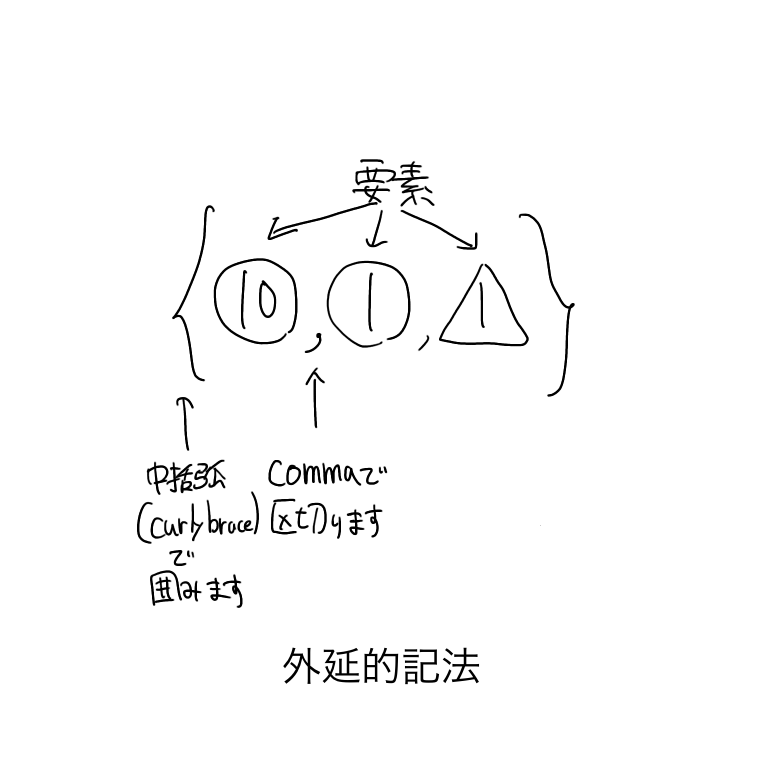
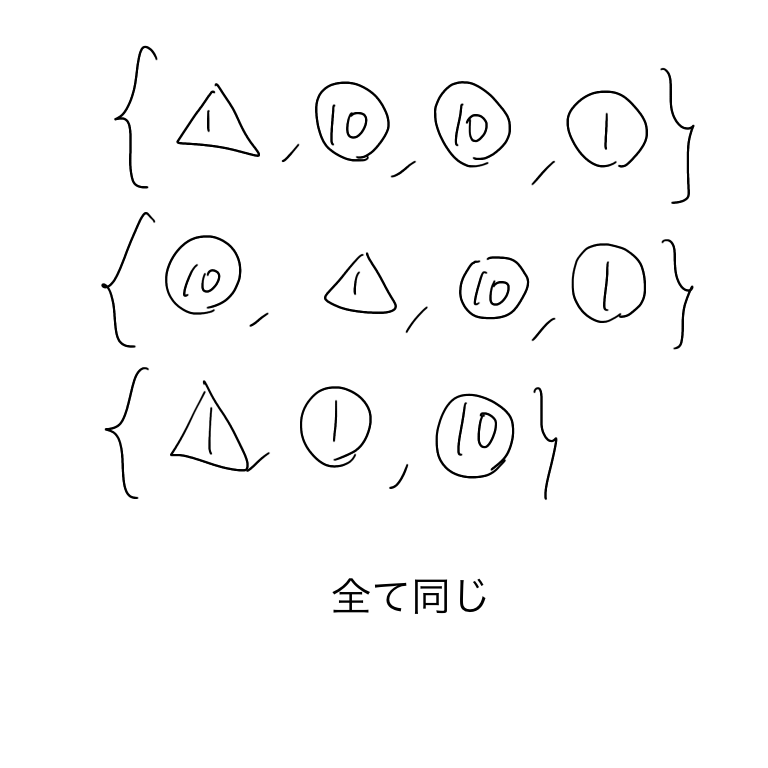
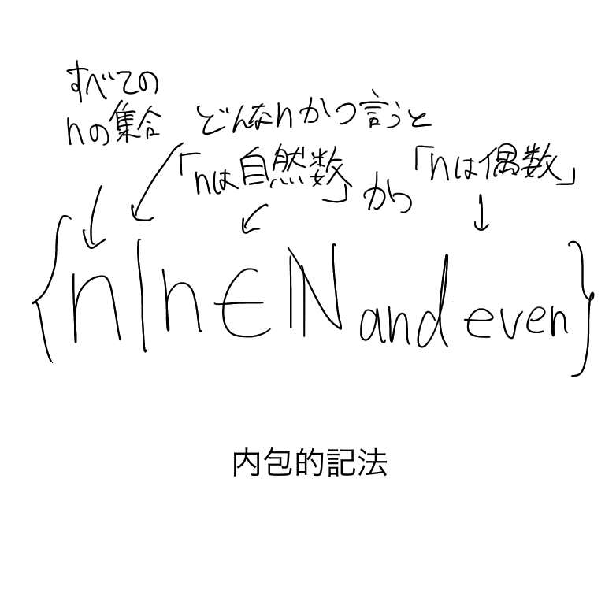

# 集合論

## 集合

**集合**とは｢順序付けられていない,どんなものでもいい(集合も含めて)異なるものの集まり｣です

この｢もの｣を要素と言います

要素にはあらゆるものが成れます

数字だけでなく,人間や植物,惑星も｢もの｣です

集合は**外延的記法**(set notation)という"{}"という要素をくくった書き方で表現できます

集合では同じ要素のことは考慮しません

下の集合はすべて,｢3角で囲まれた1｣,｢丸で囲まれた1｣,｢丸で囲まれた10｣を含む集合を表しており同じ集合です

繰り返し出てくる要素は無視されます

$\{1, 2, 2, 2, 2, \}$という集合は,$\{1, 2\}$という集合と同じ集合なのです

## 集合と要素

**空集合**とは**要素を持たない集合です**

つまり,$\{\}$のような集合です.0にスラッシュを付けたような記号で表します

$$\{\} = \emptyset$$

また,集合と要素は区別します

$$
1 \not= \{1\}
$$

また,集合は集合も要素として持てます

下のように空集合と,空集合を持った集合は等しいのでしょうか?

$$
\emptyset \overset{?}{=} \{\emptyset\}
$$

もちろん違います.$\emptyset$は要素を持たない集合なので,空集合を要素に持つ集合とは等しくありません.

よって正しい式は次の通りです

$$
\emptyset \not= \{\emptyset\}
$$

あるもの($a$とします)がある集合($A$とします)に入っていることをaはAに｢属する｣と言います

これを式にすると以下の通り

$$
a \in A
$$

$\{1,2,3,4,5,6\}$という集合について考えます

この集合に$1$は属しているでしょうか?

もちろん,$1$は属しています.つまり以下のように書けます

$$
1 \in \{1,2,3,4,5,6\}
$$

では,$7$はこの集合に属しているのでしょうか?

この集合に$7$はないので属していません

よって,次のように書けます

$$
7 \not \in \{1,2,3,4,5,6\}
$$

## 無限集合

今までは要素が有限な集合について扱っていました

ここでは要素の無限に多い集合を扱しています

例えば$\mathbb{N}=\{0,1,2,3,..\}$はすべての自然数の集合です[^1][^2]

[^1]:(CSでは自然数に$0$を含むことが多いのでここでは$0$を自然数に含めています)
[^2]:英語で自然数は**Natural number**

$\mathbb{Z}=\{..., -2, -1,0,1,2\}$はすべての整数の集合です[^3]

[^3]: ドイツ語で整数は**Zahlen**(英語では**Integer**)

外延的記法では｢すべての自然数の集合｣のような集合を厳密に書けません

このような集合を数学的に書くには**内包的記法**(set-builder notation)を用います

以下のように内包的記法は書きます

つまり

$$
\{x | \text{$x$が満たすある条件}\}
$$

という風に書くのが内包的記法です

## 集合の組み合わせ

### ベン図

## 部分集合と冪集合

## 濃度

## これがどうコンピュータと関係するのか

## まとめ
